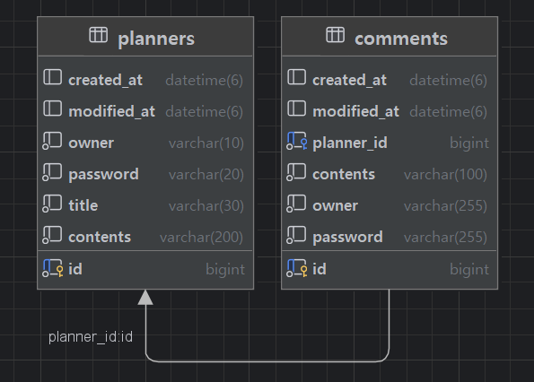

# 📅 일정 관리 API (Planner API)

Spring Boot 기반의 일정 관리 REST API입니다. 일정을 생성, 조회, 수정, 삭제할 수 있으며, 각 일정에 댓글을 작성할 수 있습니다.

## 🛠 기술 스택

- **Language**: Java
- **Framework**: Spring Boot 3.x
- **ORM**: Spring Data JPA
- **Database**: MySQL 8.0
- **Build Tool**: Gradle
- **Architecture**: 3-Layer Architecture (Controller - Service - Repository)

## 📊 ERD



**관계**: Planner 1 : N Comment (일정 하나에 댓글 최대 10개)

## 🚀 실행 방법

### 1. 데이터베이스 준비
```sql
CREATE DATABASE planners;
```

### 2. 애플리케이션 실행
```bash
./gradlew bootRun
```

서버는 `http://localhost:8080`에서 실행됩니다.

## 📡 API 명세

### Base URL
```
http://localhost:8080
```

---

## 📌 일정 관리 API

### 1. 일정 생성

**POST** `/planners`

일정을 새로 생성합니다.

#### Request Body
```json
{
  "title": "프로젝트 회의",
  "contents": "Spring Boot 프로젝트 진행 상황 논의",
  "owner": "홍길동",
  "password": "1234"
}
```

| 필드 | 타입 | 필수 | 설명 |
|------|------|------|------|
| title | String | O | 일정 제목 |
| contents | String | O | 일정 내용 |
| owner | String | O | 작성자명 |
| password | String | O | 비밀번호 (수정/삭제 시 사용) |

#### Response
**Status**: `201 Created`
```json
{
  "id": 1,
  "title": "프로젝트 회의",
  "contents": "Spring Boot 프로젝트 진행 상황 논의",
  "owner": "홍길동",
  "createdAt": "2026-01-02T12:00:00",
  "modifiedAt": "2026-01-02T12:00:00"
}
```

---

### 2. 일정 단건 조회

**GET** `/planners/{plannerId}`

특정 일정을 조회합니다. 해당 일정의 댓글 목록도 함께 반환됩니다.

#### Path Parameters
| 파라미터 | 타입 | 설명 |
|---------|------|------|
| plannerId | Long | 일정 ID |

#### Response
**Status**: `200 OK`
```json
{
  "id": 1,
  "title": "프로젝트 회의",
  "owner": "홍길동",
  "contents": "Spring Boot 프로젝트 진행 상황 논의",
  "createdAt": "2026-01-02T12:00:00",
  "modifiedAt": "2026-01-02T12:00:00",
  "comments": [
    {
      "id": 1,
      "owner": "김철수",
      "contents": "잘 부탁드립니다!",
      "createdAt": "2026-01-02T12:30:00",
      "modifiedAt": "2026-01-02T12:30:00"
    },
    {
      "id": 2,
      "owner": "이영희",
      "contents": "화이팅!",
      "createdAt": "2026-01-02T13:00:00",
      "modifiedAt": "2026-01-02T13:00:00"
    }
  ]
}
```

---

### 3. 일정 목록 조회

**GET** `/planners`

모든 일정을 조회하거나, 작성자명으로 필터링하여 조회합니다.

#### Query Parameters (선택)
| 파라미터 | 타입 | 필수 | 설명 |
|---------|------|------|------|
| owner | String | X | 작성자명 필터 |

#### Response
**Status**: `200 OK`

**전체 조회 예시**: `GET /planners`
```json
[
  {
    "id": 1,
    "title": "프로젝트 회의",
    "owner": "홍길동",
    "contents": "Spring Boot 프로젝트 진행 상황 논의",
    "createdAt": "2026-01-02T12:00:00",
    "modifiedAt": "2026-01-02T12:00:00",
    "comments": []
  },
  {
    "id": 2,
    "title": "팀 빌딩",
    "owner": "김철수",
    "contents": "팀 빌딩 활동 계획",
    "createdAt": "2026-01-02T14:00:00",
    "modifiedAt": "2026-01-02T14:00:00",
    "comments": []
  }
]
```

**작성자 필터링 예시**: `GET /planners?owner=홍길동`
```json
[
  {
    "id": 1,
    "title": "프로젝트 회의",
    "owner": "홍길동",
    "contents": "Spring Boot 프로젝트 진행 상황 논의",
    "createdAt": "2026-01-02T12:00:00",
    "modifiedAt": "2026-01-02T12:00:00",
    "comments": []
  }
]
```

---

### 4. 일정 수정

**PUT** `/planners/{plannerId}`

일정의 제목과 작성자명을 수정합니다. 비밀번호 검증이 필요합니다.

#### Path Parameters
| 파라미터 | 타입 | 설명 |
|---------|------|------|
| plannerId | Long | 일정 ID |

#### Request Body
```json
{
  "title": "프로젝트 회의 (수정)",
  "owner": "홍길동",
  "password": "1234"
}
```

| 필드 | 타입 | 필수 | 설명 |
|------|------|------|------|
| title | String | O | 수정할 제목 |
| owner | String | O | 수정할 작성자명 |
| password | String | O | 비밀번호 (검증용) |

#### Response
**Status**: `200 OK`
```json
{
  "id": 1,
  "title": "프로젝트 회의 (수정)",
  "contents": "Spring Boot 프로젝트 진행 상황 논의",
  "owner": "홍길동",
  "createdAt": "2026-01-02T12:00:00",
  "modifiedAt": "2026-01-02T15:00:00"
}
```

---

### 5. 일정 삭제

**DELETE** `/planners/{plannerId}`

일정을 삭제합니다. 비밀번호 검증이 필요합니다.

#### Path Parameters
| 파라미터 | 타입 | 설명 |
|---------|------|------|
| plannerId | Long | 일정 ID |

#### Request Body
```json
{
  "password": "1234"
}
```

| 필드 | 타입 | 필수 | 설명 |
|------|------|------|------|
| password | String | O | 비밀번호 (검증용) |

#### Response
**Status**: `204 No Content`

응답 본문 없음

---

## 💬 댓글 관리 API

### 6. 댓글 생성

**POST** `/planners/{plannerId}/comments`

특정 일정에 댓글을 작성합니다. 하나의 일정에는 최대 10개의 댓글만 작성할 수 있습니다.

#### Path Parameters
| 파라미터 | 타입 | 설명 |
|---------|------|------|
| plannerId | Long | 일정 ID |

#### Request Body
```json
{
  "contents": "좋은 일정이네요!",
  "owner": "김철수",
  "password": "5678"
}
```

| 필드 | 타입 | 필수 | 설명 |
|------|------|------|------|
| contents | String | O | 댓글 내용 |
| owner | String | O | 작성자명 |
| password | String | O | 비밀번호 |

#### Response
**Status**: `201 Created`
```json
{
  "id": 1,
  "contents": "좋은 일정이네요!",
  "owner": "김철수",
  "createdAt": "2026-01-02T12:30:00",
  "modifiedAt": "2026-01-02T12:30:00",
  "plannerId": 1
}
```

---

## ⚠️ 에러 응답

### 404 Not Found
존재하지 않는 일정을 조회/수정/삭제하려고 할 때
```json
{
  "timestamp": "2026-01-02T12:00:00",
  "status": 404,
  "error": "Not Found",
  "message": "존재하지 않는 일정입니다."
}
```

### 400 Bad Request
댓글 개수가 10개를 초과할 때
```json
{
  "timestamp": "2026-01-02T12:00:00",
  "status": 400,
  "error": "Bad Request",
  "message": "댓글은 10개까지만 작성할 수 있습니다."
}
```

비밀번호가 일치하지 않을 때
```json
{
  "timestamp": "2026-01-02T12:00:00",
  "status": 400,
  "error": "Bad Request",
  "message": "비밀번호가 일치하지 않습니다."
}
```

---

## 🎯 주요 기능

### ✅ 일정 관리
- 일정 생성, 조회, 수정, 삭제 (CRUD)
- 작성자명으로 일정 필터링
- 비밀번호 기반 인증 (수정/삭제)

### ✅ 댓글 관리
- 일정에 댓글 작성
- 일정당 최대 10개 댓글 제한
- 일정 조회 시 댓글 목록 포함

### ✅ 데이터 관리
- JPA Auditing을 통한 자동 생성/수정 시간 관리
- 양방향 연관관계 매핑 (Planner ↔ Comment)

---

## 📝 API 테스트 예시 (cURL)

### 일정 생성
```bash
curl -X POST http://localhost:8080/planners \
  -H "Content-Type: application/json" \
  -d '{
    "title": "프로젝트 회의",
    "contents": "Spring Boot 프로젝트 진행 상황 논의",
    "owner": "홍길동",
    "password": "1234"
  }'
```

### 일정 조회
```bash
curl -X GET http://localhost:8080/planners/1
```

### 댓글 작성
```bash
curl -X POST http://localhost:8080/planners/1/comments \
  -H "Content-Type: application/json" \
  -d '{
    "contents": "좋은 일정이네요!",
    "owner": "김철수",
    "password": "5678"
  }'
```

---

## 📂 프로젝트 구조

```
src/main/java/com/example/planner/
├── controller/
│   ├── PlannerController.java
│   └── CommentController.java
├── service/
│   ├── PlannerService.java
│   └── CommentService.java
├── repository/
│   ├── PlannerRepository.java
│   └── CommentRepository.java
├── entity/
│   ├── Planner.java
│   └── Comment.java
└── dto/
    ├── CreatePlannerRequest.java
    ├── CreatePlannerResponse.java
    ├── GetPlannerResponse.java
    ├── UpdatePlannerRequest.java
    ├── UpdatePlannerResponse.java
    ├── DeletePlannerRequest.java
    ├── CreateCommentRequest.java
    ├── CreateCommentResponse.java
    └── GetCommentResponse.java
```

---

## 👨‍💻 개발자

- **개발 기간**: 2025sus 12월 ~ 2026년 1월
- **개발 환경**: Spring Boot 3.x, MySQL 8.0

---

## 📄 라이센스

This project is licensed under the MIT License.